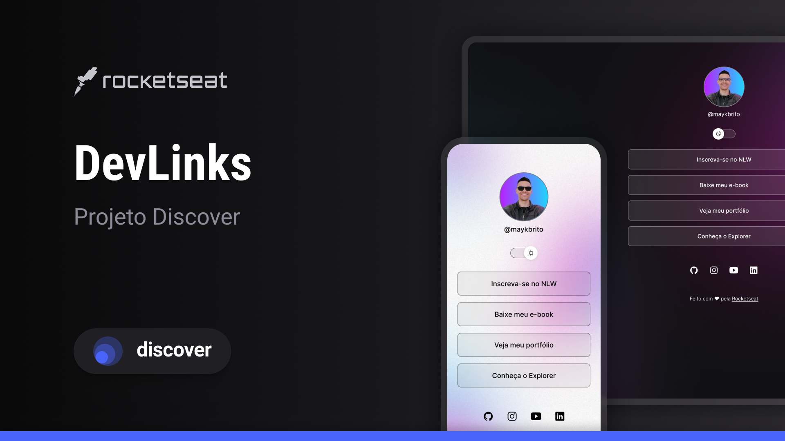

<h1 align="center"> LINKS - ROCKETSEAT </h1>

Projeto exclusivo e gratuito, desenvolvido pela Rocketseat para ensino de tecnologias WEB adaptado para uso pessoal.

<!--

  <a href="#-tecnologias">Tecnologias</a>&nbsp;&nbsp;&nbsp;|&nbsp;&nbsp;&nbsp;
  <a href="#-projeto">Projeto</a>&nbsp;&nbsp;&nbsp;|&nbsp;&nbsp;&nbsp;
  <a href="#-layout">Layout</a>

  

-->

## 🚀 Tecnologias

Esse projeto foi desenvolvido com as seguintes tecnologias:

- HTML e CSS
- JavaScript
- Git e Github
- Figma

## 💻 Projeto

Este é um agregador de links para usar como cartão de visitas online.

- <a href="https://shanakellyy.github.io/links-rocketseat/">Acesse</a> o projeto finalizado

## 🔖 Layout

Você pode visualizar o layout do projeto original através <a href="https://www.figma.com/community/file/1187422022288947321">DESSE LINK</a>. É necessário ter conta no Figma para acessá-lo.

Projeto feito com ♥ por Shana Kelly
